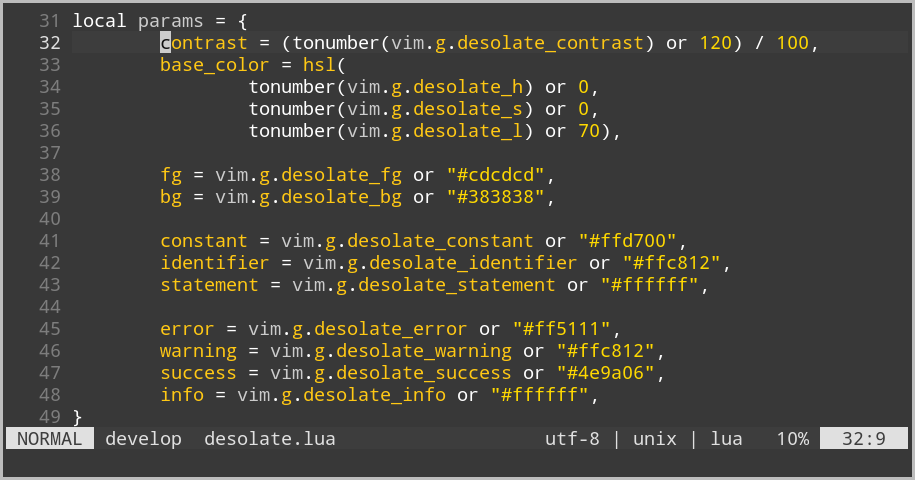
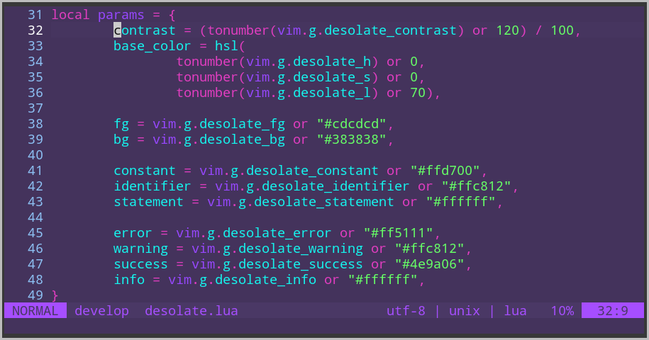

# desolate.nvim

Another not-so-colorful neovim colorscheme based on
[m o n o t o n e](https://github.com/Lokaltog/monotone.nvim).

## Installation

This colorscheme depends on [lush.nvim](https://github.com/rktjmp/lush.nvim). Example using packer.nvim:

```lua
require('packer').startup(function()
  -- ...
  use 'rktjmp/lush.nvim'
  use 'He4eT/desolate.nvim'
  -- ...
end)

vim.cmd [[colorscheme desolate]]
```

## Customization

The background and normal text colors can be configured with:
```lua
vim.g.desolate_bg
vim.g.desolate_fg
```

Accent colors may be defined by setting:
```lua
vim.g.desolate_constant
vim.g.desolate_identifier
vim.g.desolate_statement
```

Colors for error, warning, success and info messages:
```lua
vim.g.desolate_error
vim.g.desolate_warning
vim.g.desolate_success
vim.g.desolate_info
```

The base color may be customized by setting HSL values with:
```lua
vim.g.desolate_[hsl]
```

Also you may slightly adjust the colorscheme contrast to your liking by setting:
```lua
vim.g.desolate_contrast
```

## Configuration example

### Default colors



```lua
vim.g.desolate_h = 0
vim.g.desolate_s = 0
vim.g.desolate_l = 70
vim.g.desolate_contrast = 120

vim.g.desolate_fg = '#cdcdcd'
vim.g.desolate_bg = '#383838'

vim.g.desolate_constant = '#ffd700'
vim.g.desolate_identifier = '#ffc812'
vim.g.desolate_statement = '#ffffff'

vim.g.desolate_error = '#ff5111'
vim.g.desolate_warning = '#ffc812'
vim.g.desolate_success = '#4e9a06'
vim.g.desolate_info = '#ffffff'
```
### Sketchy Evangelion Unit-01 colors



```lua
vim.g.desolate_h = 210
vim.g.desolate_s = 80
vim.g.desolate_l = 120
vim.g.desolate_contrast = 100

vim.g.desolate_fg = '#9747ff'
vim.g.desolate_bg = '#44335c'

vim.g.desolate_constant = '#66ff66'
vim.g.desolate_identifier = '#15f4ee'
vim.g.desolate_statement = '#e13dc0'
```
